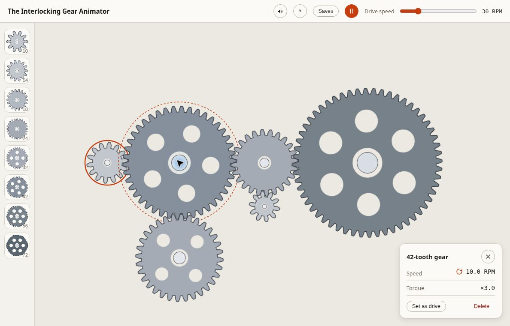
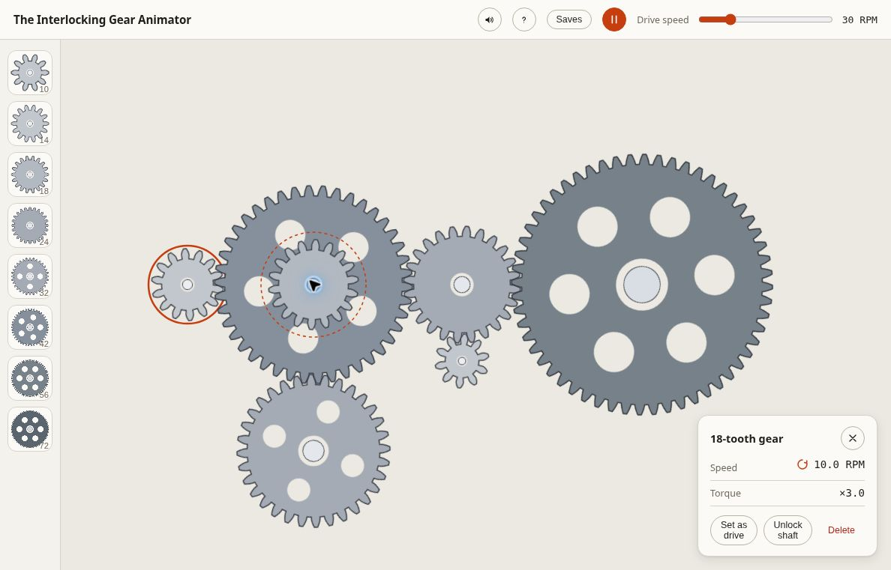

# The Interlocking Gear Animator

**Build a gear train. Change the drive. Watch the ratios move.**

A browser-based mechanical sandbox for arranging gears, snapping them into contact, and inspecting their speed, direction, and ideal torque multiplier. Drag from the palette, watch the placement preview, then select a gear to see how the drive reaches it.

[Open the workbench](https://gears.graydonwasil.com/) · [Build a train](#build-your-first-train) · [Controls](#workbench-controls) · [The model](#what-the-readouts-mean) · [Run locally](#run-locally)



*Actual live capture: the 14-tooth drive is set to 30 RPM.*

## Build your first train

1. Drag a gear from the palette onto the empty bench. The first gear becomes the drive.
2. Drag another near it. The ghost preview shows the proposed contact before you release.
3. Select the second gear and inspect RPM, rotation direction, and torque multiplier.
4. Change the drive-speed slider, pause the machine, or choose a different **Set as drive** gear.
5. Open **Saves** to keep a named design alongside the automatic browser save.

Eight palette sizes are available: **10, 14, 18, 24, 32, 42, 56, and 72 teeth**. Clicking/tapping a palette button or pressing Enter on it also places a gear.

## What the readouts mean

A smaller gear driving a larger one trades speed for an ideal torque multiplier. For a directly meshed pair:

| Input | Output |
| --- | --- |
| 14-tooth drive at 30 RPM | 42-tooth gear at 10 RPM |
| One external mesh | Opposite rotation direction |
| Drive speed divided by output speed | ×3 ideal torque multiplier |

This exact 14-to-42 example is shown in the live capture above. Gear trains propagate inverse tooth-count ratios through meshed connections, and external meshes alternate direction. Locked shaft partners retain the same speed and direction.

This is an **ideal kinematic model**. It does not simulate friction, inertia, loads, or torque in physical units. The multiplier is the magnitude of drive RPM divided by the selected gear’s RPM, not a motor-load calculation.

## Workbench controls

| Control | Action |
| --- | --- |
| Gear palette | Choose a tooth count and place a new gear |
| Drag on the bench | Move an unlocked gear with a proposed snap/contact preview |
| Select a gear | Inspect RPM, direction, and torque multiplier |
| **Set as drive** | Make the selected gear the input |
| Drive-speed slider | Set 5–120 RPM |
| Run / Pause | Start or stop motion |
| Sound toggle | Enable or mute synthesized mechanical feedback |
| **Delete** | Remove the selected gear |
| **Saves** | Manage six named browser-local design slots |
| Shortcuts panel | Review keyboard controls |

Refused placements explain their reason: collision, a mechanism that would lock, incompatible phases, or a full compound shaft. Pause and try a clearer arrangement rather than assuming every visual overlap is a valid mesh.

## Compound pairs

Drop a new gear onto another gear’s center to lock the two onto one shaft. A bolt marks the pair, the layers co-rotate, and **Unlock shaft** separates the lock. A shaft supports two gears.



Compound placement is constrained by the current shared-plane collision rules. A smaller layer can be obstructed by its larger partner when you try to add another meshing gear. The app supports shaft locking and co-rotation; it should not be treated as a general multi-plane gearbox-design tool.

## Sound follows the contacts

The app synthesizes contact ticks, a drive hum, and feedback for snaps, refusals, and saves through Web Audio. No recorded audio files are required.

Tick timing follows the **tooth-pass rate at a contact**. A 10-tooth drive at 30 RPM passes five teeth per second; its correctly meshed partner shares that contact rate even when its own rotational RPM differs.

Browser audio starts after a user gesture. Use the speaker toggle to control sound; the preference is remembered locally.

## Save and experiment

The current bench autosaves to localStorage after a roughly 500 ms debounce. The **Saves** panel provides six named slots with Restore, Update, and Delete. Gear deletion and save replacement/deletion/restore offer six-second undo toasts.

There is no account or server-side design library. Saved work belongs to this browser’s site storage; clearing that storage can remove it. A loaded app needs no simulation backend, but the repository does not provide a service worker or offline-install workflow that guarantees offline reopening.

## Keyboard and motion

| Key | Action |
| --- | --- |
| Enter on a palette button | Place that gear size |
| Arrow keys | Nudge the selected gear by 2 pixels |
| Shift + arrow keys | Nudge by 12 pixels |
| Delete / Backspace | Remove the selected gear |
| Space, outside text inputs and buttons | Toggle motion |
| Escape | Close Saves first; otherwise clear the selection |

Nudge distances are requested offsets, subject to snapping and placement refusal. The app includes keyboard placement/nudging and announcements, but existing canvas gears are not individual keyboard-focusable elements. It is not a claim of complete non-pointer equivalence. Escape does not close the shortcuts panel in the current implementation.

Reduced-motion preferences start the machine paused unless a saved explicit motion choice overrides that default. The gears remain drawn, with a visible playback control.

## Stack and architecture

| Layer | Technology | Responsibility |
| --- | --- | --- |
| Interface | React 19 and TypeScript 6 | Palette, inspector, controls, saves, and interaction state |
| Simulation | Tooth-ratio and phase constraints | Resolve ideal speeds/directions and validate connections |
| Rendering | Canvas 2D with per-size sprite caching | Draw gear profiles once, then rotate cached sprites |
| Sound | Web Audio | Generate contact/drive/feedback sounds |
| Persistence | localStorage | Autosave, named slots, and preferences |
| Build/checks | Vite 8, ESLint, Vitest, Playwright | Development, static build, source checks, and browser tests |

Gear shapes use sampled involute-style flanks with radial extension below the base circle; undercutting is omitted. The geometry is for the interactive visual model, not manufacturing or CAD output.

## Run locally

Use **Node.js 24** for the complete development/check toolchain.

```sh
git clone https://github.com/Arrangedgodly/gears.git
cd gears
npm ci
npm run dev
```

Open the URL Vite prints, normally `http://localhost:5173/`.

| Command | Purpose |
| --- | --- |
| `npm run check` | Type-check, lint, and run unit tests |
| `npm run build` | Build production assets into `dist/` |
| `npm run preview` | Serve the built app locally |
| `npx playwright install chromium` | Install the browser required by the end-to-end suite |
| `npm run e2e` | Run Playwright tests |

The `e2e` script does not install Chromium itself. Run the explicit browser-install command once on a new development machine.

## Verification and current limits

Live review confirmed gear placement, a six-gear train, ratio readouts, compound locking, the smaller-layer collision limitation, a named save, speed adjustment, and autosave restoration after reload.

No new build, lint, unit, or end-to-end suite was run for this documentation pass. The repository includes a 23-gear performance benchmark with a minimum-frame-rate assertion and a one-minute soak; it is a test harness rather than a universal promise of 60 FPS on every laptop.

At the review viewport, the Saves panel’s empty-slot grid overflowed its panel. That layout issue remains separate from the verified save/restore behavior.

## Explore the implementation

- [Kinematic solver](src/sim/kinematics.ts): speed propagation and ideal ratios
- [Placement rules](src/sim/placement.ts): contact and collision constraints
- [Gear profiles](src/render/involute.ts): sampled rendering geometry
- [Persistence](src/state/persistence.ts): browser-local save handling
- [Performance test](e2e/performance.spec.ts): benchmark and soak harness

`PRODUCT.md` contains earlier planning decisions, including some features that were later implemented. Use the current source for behavior and limits. No root project license is provided.
